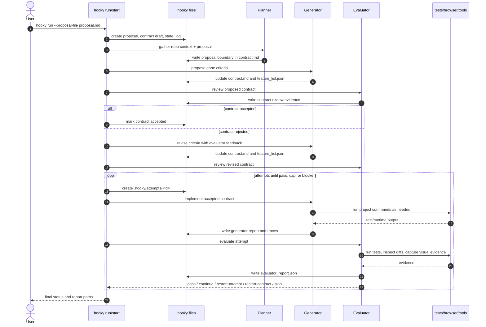
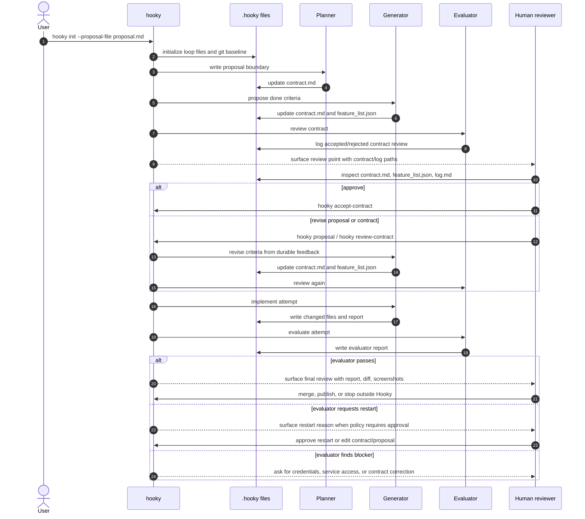
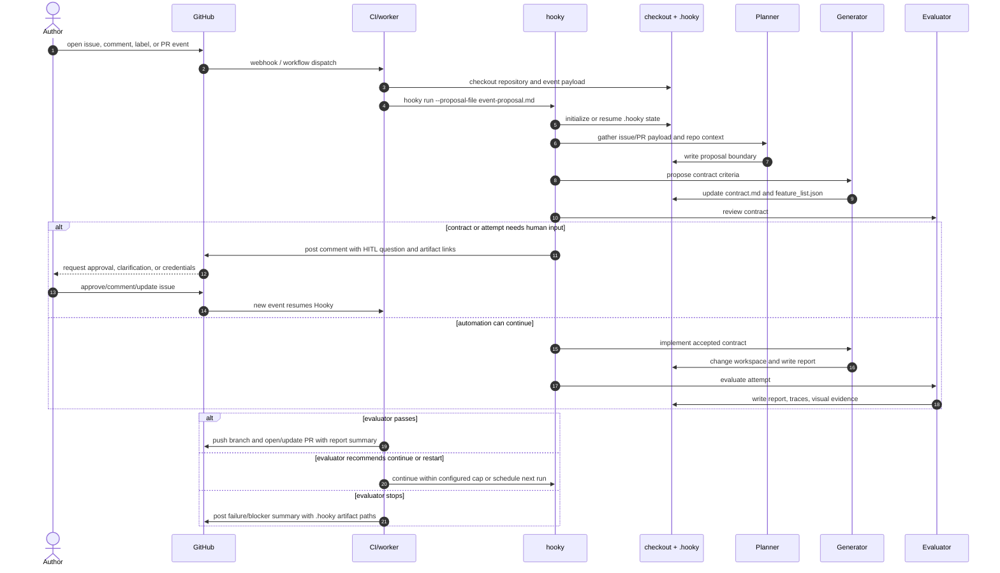

# Usage Sequences

These diagrams show the common ways Hooky is expected to run. The same loop
state is used in every case: `.hooky/proposal.md`, `.hooky/contract.md`,
`.hooky/feature_list.json`, `.hooky/progress.md`, `.hooky/log.md`, and
attempt artifacts under `.hooky/attempts/<id>/`.

## Auto-Approve Flow

Use this for trusted local runs where the evaluator is allowed to accept the
contract and decide whether to continue, restart, or pass without stopping for a
human gate.

## Flow With HITL

Use this when a human should approve the contract, a restart, external
side-effects, or the final merge decision. The human is not another model role;
the human changes durable files or issues an explicit command.

## GitHub Event Flow

Use this shape when GitHub opens or updates work and Hooky runs as automation.
GitHub is a trigger and publication surface; Hooky still records loop truth on
disk before posting summaries back to GitHub.

## Ordinary HITL Points

The usual human review points are:

- before accepting a contract when requirements are ambiguous or high impact
- before using credentials, paid services, deployment targets, or destructive commands
- before `restart-contract`, because that changes what done means
- before publishing a branch, opening a pull request, merging, or deploying
- when the evaluator reports a blocker that automation cannot resolve from repo state
